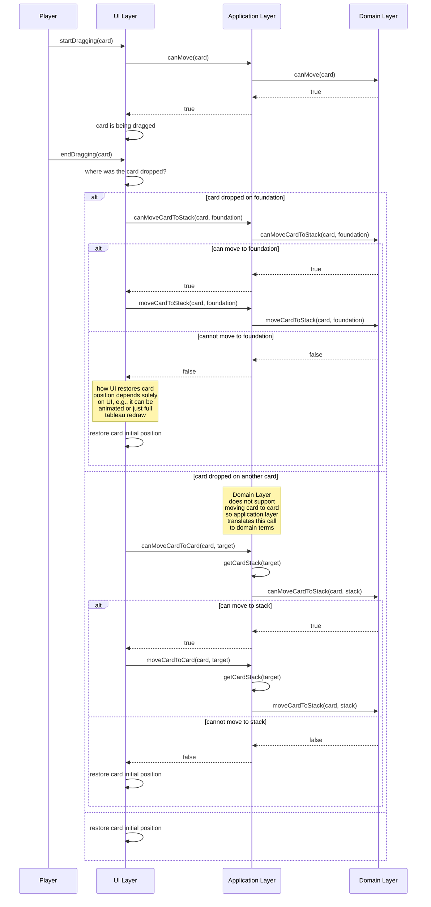
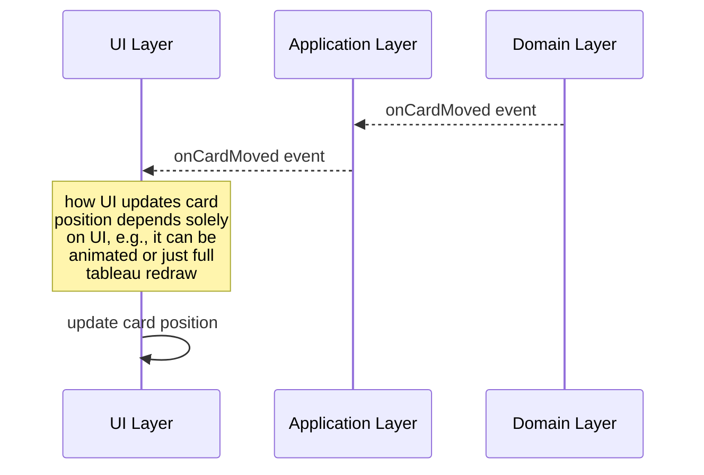
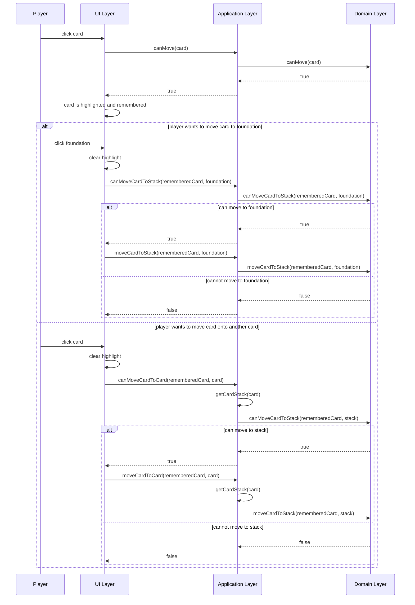

# Solitaires

This is a collection of solitaire games. All of them has shared kernel and has the same architecture.

## General

The applications consist of 3 layers:
- UI layer: allows user to interact with a game
- Application layer: handles application actions, i.e., implements actions user can do  
these actions do not map one-to-one to actions in domain model
- Domain Layer: contains domain model that is responsible for game logic, it ensures that game is always in a valid state

Application layer provides methods to control state of the application. Application state includes game, its state and any other data that is not a part of domain layer, but is part of the application.

Application layer is UI-technology agnostic, so can be used by different UIs.



How changes are propagated from Domain layer to UI:



Another UI that does not support drag-and-drop feature might work like following:



Difference between application layer and domain layer can be seen in following examples:
- application layer has methods `canMoveCardToCard` and `moveCardToCard` whereas domain layer does not provide such ability, so application layer does mapping to domain terms
- application layer can provide methods that are completely outside of domain, for example, `GameService` provides methods for undo/redo functionality using `History` class not from domain
- application layer can provide extra functionality to the game, for example, order-violations and auto-build features resides in application layer as they're part of game, but are not part of domain

### Building

To install application dependencies (required to build the application and to run tests):

```bash
npm install
```

To build application:
```bash
npm run build
```

To run tests:
```bash
npm test
```

To run application open `wwwroot/index.html` in browser.

## Besieged Fortress Solitaire

### Rules

**Deck**: 36 cards.  
**Goal**: place all cards on bases from 6 to king of the same suit.  
**Initial position**: aces are dealt in column - bases. Other cards are dealt in 8 rows: 4 on the left side of the bases, 4 - on the right side.  
**How to play**: only one card can be moved in one turn. Only last cards of each of the 8 rows are available for moves. Card can be moved to: 1) base if it will form correct sequence, 2) on other available card if it's value is one less than value of the card is moved to, 3) on empty space left after all cards from some row are moved.

### Controls

You can use drag-and-drop to move cards around. Double-click on a card will try to move it to base.

## Bisley Solitaire

### Rules

First the four aces are taken out and laid on the tableau to start the foundations. Then four columns of three cards are placed overlapping each other separately under the aces. After that, nine columns of four cards, also overlapping each other, are dealt to the right of the aces and first four columns. The initial layout of the game of Bisley. This follows the overlapping-cards rule set rather than the laying-out-the-cards rule set.

Here is the method of game play:

- Only the bottom, exposed cards in each column are available for play.
- Only one card can be moved at a time.
- The cards on the tableau can be built either up or down by suit.
- Whenever a column becomes empty, it stays empty for the rest of the game.
- The foundations (the four aces) are built up by suit. However, whenever a King is released and becomes available, it becomes a foundation and is placed above its counterpart ace foundation to be built down, also by suit. The same thing can be done for the three other kings. This rule also gives the player an opportunity to place a card on one of the foundations of the same suit if it can be placed on either of them.

The game is finished when all cards end up in the foundations.

### Controls

Click on available card to select it, then click where you want the card to be moved to. Double click on a card will try to move it to foundation.
